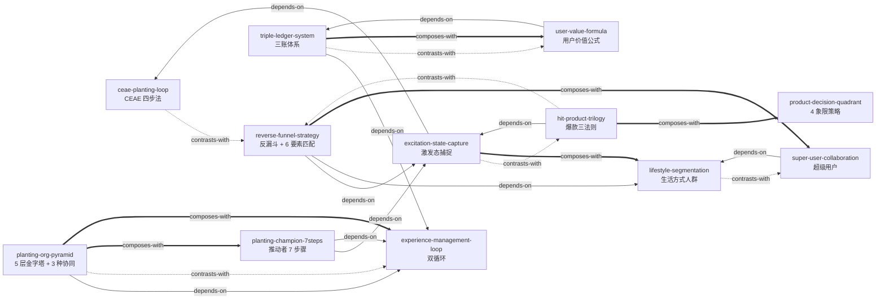

# 《种草》— Skill Index

> 本书由 cangjie-skill 蒸馏, 共产出 **12** 个 skills。
> 处理时间: 2026-08-25

## 关于这本书

- **作者**: 小红书种草方法论项目组 / 小红书商业团队 (基于多企业调研共同提炼)
- **出版年**: 2024
- **一句话主旨**: 种草不是营销话术,而是企业用"捕捉-理解-放大-激发"的工作流,**真诚地帮助人实现向往的生活**,从而让用户从价值的接受者变成价值的共同创造者。
- **整书理解**: 见 [BOOK_OVERVIEW.md](./BOOK_OVERVIEW.md)
- **精华长文** (不读全书看这篇): [DIGEST.md](./DIGEST.md)
- **术语词典**: [GLOSSARY.md](./GLOSSARY.md)

---

## Skill 列表 (按主题分组)

### 一、核心种草心法层 (全书骨架)

- [`ceae-planting-loop`](./ceae-planting-loop/SKILL.md) — 捕捉-理解-放大-激发 四步法,种草型企业日常运转的核心动作循环。
- [`excitation-state-capture`](./excitation-state-capture/SKILL.md) — 激发态捕捉:识别用户从被动变主动的临界瞬间,作为种草起点。
- [`hit-product-trilogy`](./hit-product-trilogy/SKILL.md) — 爆款三法则(足够好+全面优秀+准确取舍)+ 4 种产品机会来源 + 用户体验公式。

### 二、人群与对象层

- [`lifestyle-segmentation`](./lifestyle-segmentation/SKILL.md) — 生活方式人群划分法:用"底层驱动+生活向往"替代人口学/兴趣标签。
- [`reverse-funnel-strategy`](./reverse-funnel-strategy/SKILL.md) — 反漏斗人群扩散 + 6 要素极致匹配:先打核心人群再放大。
- [`super-user-collaboration`](./super-user-collaboration/SKILL.md) — 4 类超级用户识别与合作机制。

### 三、组织与人才层

- [`planting-org-pyramid`](./planting-org-pyramid/SKILL.md) — 种草型组织 5 层金字塔 + 3 种协同路径(集权/采购关系/共同接触)。
- [`experience-management-loop`](./experience-management-loop/SKILL.md) — 效率管理循环 + 体验管理循环 双循环并行运转。

### 四、算账与评估层

- [`triple-ledger-system`](./triple-ledger-system/SKILL.md) — 算对账三账体系(体验账+用户价值账+营销全链路账)+ (T+X) ROI + 因果指标。
- [`user-value-formula`](./user-value-formula/SKILL.md) — 用户价值公式 LTV + 影响力价值 + 建议价值,及内部-外部双标准评价体系。

### 五、推动与变革层

- [`planting-champion-7steps`](./planting-champion-7steps/SKILL.md) — 种草推动者 7 步骤:从找原点到建立制度的个人行动框架。

### 六、品类策略层

- [`product-decision-quadrant`](./product-decision-quadrant/SKILL.md) — 轻/重决策 × 商品/服务 四象限策略。

---

## 引用图 (skill 之间的依赖/对比/组合关系)



图例:
- `-->`  depends-on (依赖)
- `-.->` contrasts-with (对比)
- `===>` composes-with (组合)

---

## 推荐学习顺序 (从依赖图叶子节点开始)

**入门组** (没有前置依赖,可单独学习):
1. **`excitation-state-capture`** — 最基础,种草的起点
2. **`hit-product-trilogy`** — 产品层的爆款方法论,独立闭环
3. **`lifestyle-segmentation`** — 人群划分的核心方法

**进阶组** (依赖入门组):
4. **`ceae-planting-loop`** — 全局循环,理解种草的整体节奏
5. **`super-user-collaboration`** — 需要先会人群划分
6. **`reverse-funnel-strategy`** — 需要先会捕捉+分人群
7. **`product-decision-quadrant`** — 需要先懂产品+营销

**组织层** (适合 CEO/HR/中高层):
8. **`experience-management-loop`** — 双循环运转的基础
9. **`planting-org-pyramid`** — 依赖双循环
10. **`planting-champion-7steps`** — 需要双循环+激发态基础

**算账层** (适合 CFO/数据分析师):
11. **`triple-ledger-system`** — 需要理解双循环
12. **`user-value-formula`** — 需要先懂三账体系

---

## Skill 速查表 (按场景)

| 用户在问 | 优先调用 |
|---|---|
| "怎么让用户买我的产品" / "为什么我的产品没爆" | `ceae-planting-loop` → `excitation-state-capture` → `hit-product-trilogy` |
| "目标用户是谁" / "为什么转化率低" | `lifestyle-segmentation` |
| "新品没人买" / "冷启动怎么做" | `reverse-funnel-strategy` → `excitation-state-capture` |
| "怎么找种子用户" / "KOL 没效果" | `super-user-collaboration` |
| "为什么团队不理解用户" / "考核改了行为没变" | `experience-management-loop` |
| "部门墙推不动" / "新品上线太慢" | `planting-org-pyramid` |
| "营销 ROI 怎么算" / "种草周期多长" | `triple-ledger-system` |
| "为什么用户调研 ROI 算不清" | `user-value-formula` |
| "我是中层怎么推动变革" | `planting-champion-7steps` |
| "我们品类怎么种草" / "B2B 能种草吗" | `product-decision-quadrant` |

---

## 安装使用

本目录是构建产物, 宿主不会从这里加载 skill。要让 agent 真正调用, 把 skill 目录复制到宿主的 skills 目录:

```bash
# 用户级 (所有项目可用)
cp -r {ceae-planting-loop,excitation-state-capture,hit-product-trilogy,lifestyle-segmentation,reverse-funnel-strategy,super-user-collaboration,planting-org-pyramid,experience-management-loop,triple-ledger-system,user-value-formula,planting-champion-7steps,product-decision-quadrant} ~/.claude/skills/

# 或项目级
cp -r ./<skill-slug> <project>/.claude/skills/    # Claude Code
cp -r ./<skill-slug> <project>/.cursor/skills/    # Cursor
```

---

## 接入 darwin-skill

所有 skill 均带有 `test-prompts.json` (darwin-skill 兼容格式), 可直接接入自动进化:

```
darwin evolve ./
```

> 预计高杠杆改动: dim3 (失败模式编码) 和 dim4 (检查点设计) 已通过本批 SKILL.md 的 E 段 (🔴CHECKPOINT + 🛑STOP + if-fail fallback) 内建,可省一轮 darwin 优化 (CLAUDE.md 教训)。

---

## 审计轨迹

- 整书理解: [BOOK_OVERVIEW.md](./BOOK_OVERVIEW.md)
- 候选单元池 (221 条): [candidates/](./candidates/)
- 被淘汰的候选 (29 条 + 原因): [rejected/](./rejected/)
- 验证记录: [verified.md](./verified.md), [verified-frameworks.md](./verified-frameworks.md), [verified-principles.md](./verified-principles.md)
- 案例池 (87 条按 18 主题分组): [cases-organized.md](./cases-organized.md)
- 反例池 (32 条按 12 主题分组): [counter-examples-organized.md](./counter-examples-organized.md)
- 术语词典 (21 条): [GLOSSARY.md](./GLOSSARY.md)
- 流水线状态: [PIPELINE_STATE.md](./PIPELINE_STATE.md)